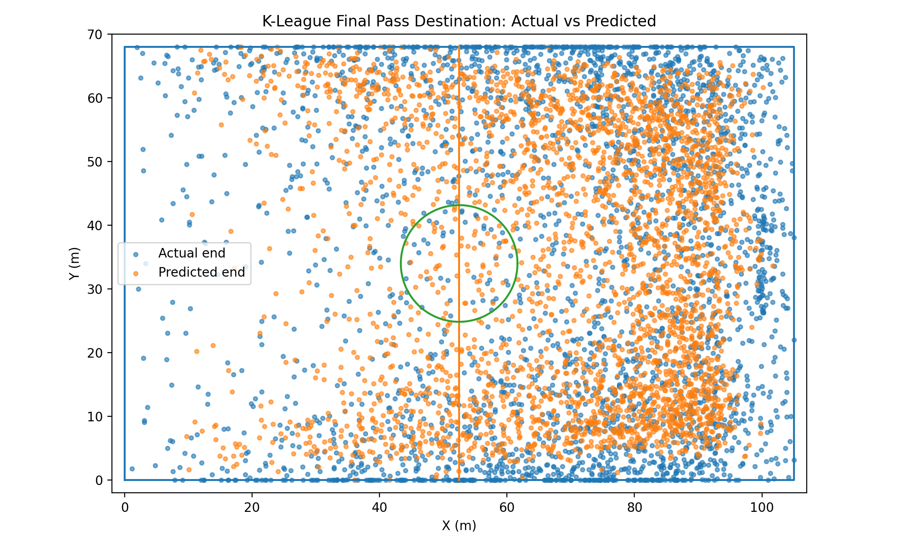
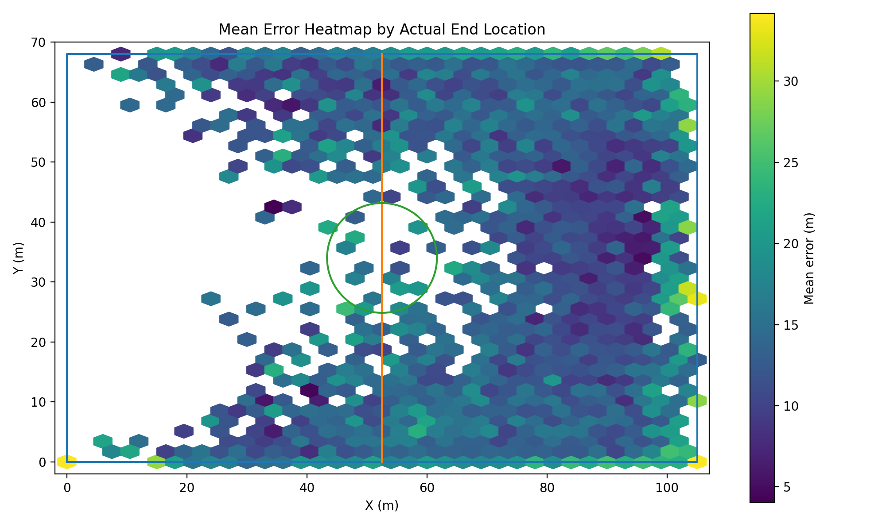
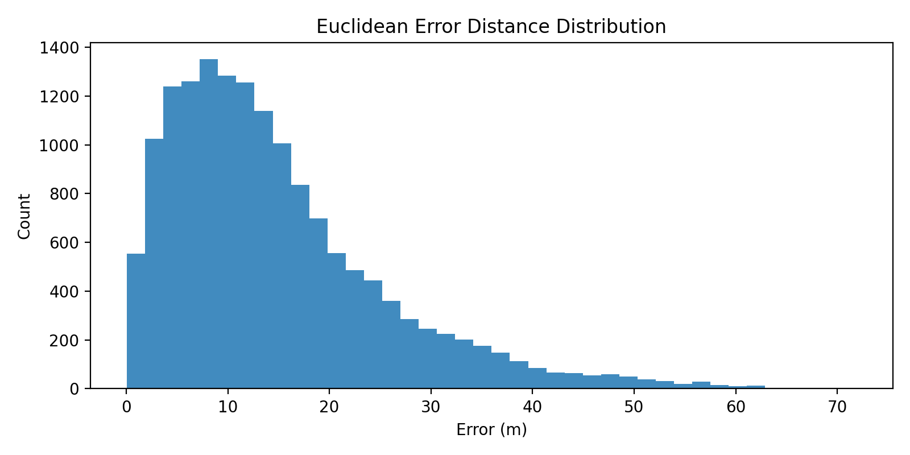
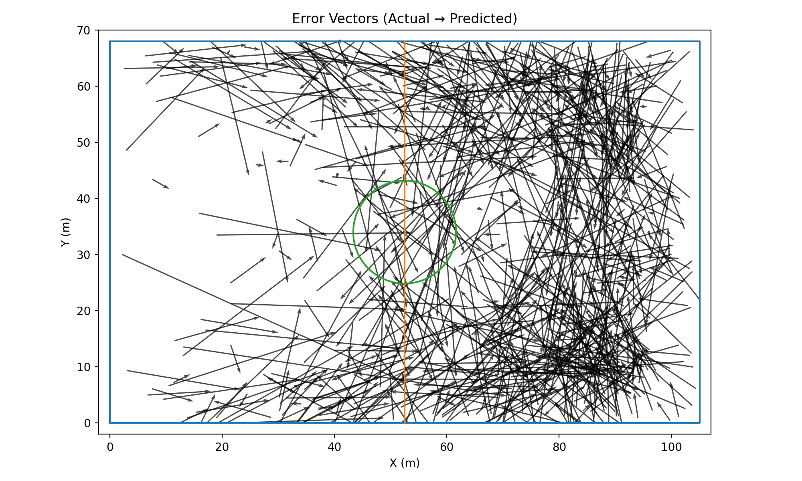

# 2025 K League Pass Prediction

## K리그 이벤트 로그 데이터 분석 및 패스 좌표 예측

K리그 경기 이벤트 로그 데이터를 `game_episode` 단위로 재구성하고, 마지막 패스 도착 좌표(`end_x`, `end_y`)를 예측한 프로젝트입니다.

이 프로젝트는 단순히 예측 모델을 학습하는 데 그치지 않고, 원본 이벤트 로그를 분석 가능한 episode 단위 데이터로 변환하고, 모델별 성능 비교와 OOF 기반 앙상블, 예측 오차 분포 및 공간적 패턴 분석까지 수행한 포트폴리오형 프로젝트입니다.

- Competition: [데이콘 | K리그 경기 패스 좌표 예측 AI 경진대회](https://dacon.io/competitions/official/236647/overview/description)

---

## 1. Project Summary

| 항목 | 내용 |
|---|---|
| 프로젝트 주제 | K리그 경기 이벤트 로그 기반 패스 도착 좌표 예측 및 오차 분석 |
| 분석 데이터 | K리그 경기 이벤트 로그 |
| 원본 학습 데이터 | 356,721 rows |
| 재구성 학습 데이터 | 15,428 episodes |
| 예측 대상 | 마지막 패스 도착 좌표 `end_x`, `end_y` |
| 주요 모델 | CatBoost, ExtraTrees, Ridge |
| 최종 방식 | OOF 기반 Optuna 가중 앙상블 |
| 최종 OOF Score | 18.9466 |
| 주요 분석 관점 | 이벤트 로그 재구성, feature engineering, 모델 비교, 오차 분포 및 공간 패턴 분석 |

---

## 2. Analytical Perspective

이 프로젝트는 패스 좌표를 예측하는 모델링 프로젝트이면서, 동시에 경기 이벤트 로그를 분석 가능한 데이터 구조로 재구성하고 결과를 해석하는 데이터 분석 프로젝트입니다.

데이터 분석가 관점에서는 다음 과정에 초점을 두었습니다.

- 이벤트 단위 raw log를 `game_episode` 기준 학습 샘플로 재구성
- episode 내 이벤트 수, 시간 범위, 좌표 통계량, 액션 유형, 성공 여부 등을 feature로 생성
- CatBoost, ExtraTrees, Ridge 모델의 성능 차이 비교
- 평균 오차, 중앙값 오차, P90 오차를 함께 확인해 예측 오차 분포 해석
- 실제 패스 도착 위치 기준 오차 히트맵을 통해 공간별 취약 구간 분석
- 단일 점수뿐 아니라 오차 방향과 worst-case 사례를 함께 확인해 모델의 한계 해석

---

## 3. Problem Definition

이 프로젝트의 목표는 경기 중 발생한 이벤트 흐름을 바탕으로 **마지막 패스의 도착 좌표**를 예측하는 것입니다.

원본 데이터는 이벤트 단위로 기록되어 있어 그대로는 예측 모델에 바로 사용하기 어렵습니다.  
따라서 각 `game_episode`를 하나의 학습 샘플로 재구성하고, 마지막 이벤트의 도착 좌표를 target으로 설정했습니다.

- **Input**: episode 내 마지막 이벤트 이전까지의 이벤트 흐름
- **Target**: 마지막 패스 도착 좌표 `end_x`, `end_y`
- **Task Type**: Regression
- **Evaluation**: 실제 좌표와 예측 좌표 간 거리 기반 오차

즉, 이벤트 로그를 **episode 단위 supervised learning 문제**로 변환한 것이 핵심입니다.

---

## 4. Dataset

### Input Files

| 파일명 | 설명 |
|---|---|
| `train.csv` | 학습용 경기 이벤트 로그 |
| `test.csv` | 예측 대상 episode 정보 |
| `match_info.csv` | 경기 메타 정보 |
| `sample_submission.csv` | 제출 형식 |

### Raw Train Columns

| 컬럼명 | 설명 |
|---|---|
| `game_id` | 경기 ID |
| `period_id` | 전/후반 구분 |
| `episode_id` | episode ID |
| `time_seconds` | 경기 시간 |
| `team_id` | 팀 ID |
| `player_id` | 선수 ID |
| `action_id` | 액션 ID |
| `type_name` | 액션 유형 |
| `result_name` | 액션 결과 |
| `start_x`, `start_y` | 이벤트 시작 좌표 |
| `end_x`, `end_y` | 이벤트 종료 좌표 |
| `is_home` | 홈/원정 여부 |
| `game_episode` | 경기-episode 결합 key |

### Data Shape

| 데이터 | 크기 |
|---|---:|
| train raw | 356,721 rows |
| test raw | 2,414 rows |
| reconstructed train episode | 15,428 rows |
| reconstructed test episode | 2,414 rows |

---

## 5. Data Processing

### 5.1 Event Log → Episode Dataset

원본 `train.csv`는 경기 이벤트 단위로 구성되어 있습니다.  
이를 `game_episode` 기준으로 그룹화한 뒤, 각 episode의 마지막 이벤트를 예측 target으로 두고, 마지막 이벤트 이전의 흐름을 feature로 변환했습니다.

### Main Features

| 구분 | 생성 feature |
|---|---|
| Episode 정보 | 이벤트 수, 고유 선수 수, 고유 액션 수 |
| 시간 정보 | 시작 시간, 종료 시간, 시간 범위 |
| 좌표 정보 | 시작 좌표 평균, 표준편차, 최소값, 최대값 |
| 직전 이벤트 정보 | 마지막 이벤트 직전 위치, 직전 액션 유형 |
| 액션 유형 | `Pass`, `Carry`, `Shot` 비율 |
| 결과 정보 | 성공/실패 이벤트 비율 |
| 이동 거리 | 이벤트별 이동 거리 기반 통계량 |
| Path 정보 | `path` 문자열 기반 토큰/숫자 feature |
| 경기 정보 | `match_info` 기반 메타 정보 |

### 5.2 Train / Test Alignment

train과 test 데이터는 구조가 일부 다르기 때문에, 모델 입력 전 feature space를 정렬했습니다.

- train/test 공통 feature 컬럼 구성
- 수치형 / 범주형 컬럼 분리
- 범주형 결측치 `"MISSING"` 처리
- 수치형 컬럼 numeric coercion 적용
- CatBoost 입력용 데이터와 One-Hot Encoding 기반 모델 입력용 데이터 분리

---

## 6. Modeling

세 가지 모델을 비교했습니다.

### CatBoost

- 범주형 feature 처리에 강점이 있어 메인 모델로 사용
- `end_x`, `end_y`를 각각 학습
- 최종 앙상블에서 가장 높은 가중치 부여

### ExtraTrees

- 비선형 관계를 포착하기 위한 보조 모델
- CatBoost와 다른 방식의 예측 패턴을 제공해 앙상블 다양성 확보

### Ridge

- 선형 베이스라인 역할
- 복잡한 모델 대비 기본 성능 확인 및 앙상블 후보로 활용

모든 모델은 교차검증 기반으로 학습했으며, OOF 예측값과 test 예측값을 함께 저장했습니다.

---

## 7. Ensemble Strategy

단순 평균 대신 **OOF(Out-of-Fold) 예측값**을 기반으로 Optuna를 사용해 최적 가중치를 탐색했습니다.

### Best Weights

| Model | Weight |
|---|---:|
| CatBoost | 0.6735 |
| ExtraTrees | 0.3257 |
| Ridge | 0.0008 |

최종 앙상블은 사실상 **CatBoost + ExtraTrees 중심 구조**였습니다.  
Ridge는 단독 성능이 낮아 최종 앙상블에서 거의 반영되지 않았습니다.

---

## 8. Results

### Cross Validation Score

| Model | CV Mean Score |
|---|---:|
| CatBoost | 18.9628 |
| ExtraTrees | 19.3920 |
| Ridge | 21.2035 |

### OOF Weighted Ensemble Score

| Model | Score |
|---|---:|
| Ensemble | 18.9466 |

CatBoost 단일 모델 대비 OOF 기반 가중 앙상블을 통해 validation 기준 성능을 소폭 개선했습니다.

---

## 9. Error Analysis

최종 앙상블 예측값을 기준으로 실제 좌표와 예측 좌표 간 거리 오차를 분석했습니다.

| Metric | Value |
|---|---:|
| Mean Error | 18.9466 |
| Median Error | 16.3242 |
| Std Error | 11.6420 |
| P90 Error | 35.5961 |
| Max Error | 87.7799 |

Median Error가 16.3242m로 Mean Error 18.9466m보다 낮게 나타났습니다.  
이는 대부분의 episode에서는 비교적 안정적인 예측이 가능했지만, 일부 큰 오차 사례가 전체 평균을 끌어올리는 구조로 해석할 수 있습니다.

또한 P90 Error가 35.5961m로 나타나, 상위 10%의 어려운 episode에서는 예측 난도가 크게 증가하는 것을 확인했습니다.

---

## 10. Visualization

예측 결과를 다양한 관점에서 분석하기 위해 시각화를 수행했습니다.  
단일 점수만으로 모델을 평가하지 않고, 실제 좌표와 예측 좌표의 분포, 오차 거리, 오차 방향, 공간별 취약 구간을 함께 확인했습니다.

<br>

### 10.1 Actual vs Predicted Final Pass Location / Mean Error Heatmap

<p align="center">
  
  
</p>

#### Actual vs Predicted Final Pass Location

실제 패스 도착 좌표와 예측 좌표를 함께 시각화했습니다.  
이를 통해 모델이 주요 패스 도착 위치의 분포를 어느 정도 따라가는지 확인했습니다.

#### Mean Error Heatmap by Actual End Location

실제 패스 도착 위치를 기준으로 평균 오차를 히트맵으로 나타냈습니다.  
특정 공간 구역에서 오차가 상대적으로 크게 발생하는 패턴을 확인하여, 모델의 공간적 취약 구간을 파악했습니다.

<br>

### 10.2 Error Distribution / Error Vectors

<p align="center">
  
  
</p>

#### Euclidean Error Distance Distribution

예측 좌표와 실제 좌표 간 거리 오차 분포를 확인했습니다.  
대부분의 예측 오차가 어느 범위에 분포하는지, 일부 큰 오차가 전체 평균에 어떤 영향을 주는지 확인했습니다.

#### Error Vectors

실제 좌표에서 예측 좌표까지의 오차 방향을 벡터로 시각화했습니다.  
이를 통해 오차가 특정 방향으로 치우치는지, 공간적으로 일관된 패턴이 있는지 확인했습니다.

---

## 11. Project Structure

```text
2025-K-League-Pass-Prediction/
├─ src/
│  ├─ __init__.py
│  ├─ config.py
│  ├─ utils.py
│  ├─ metrics.py
│  ├─ data_utils.py
│  └─ feature_engineering.py
├─ scripts/
│  ├─ 01_eda.py
│  ├─ 02_train_models.py
│  ├─ 03_find_best_weights.py
│  ├─ 04_make_submission.py
│  └─ 05_error_analysis.py
├─ images/
│  ├─ 01_actual_vs_pred.png
│  ├─ 02_error_heatmap.png
│  ├─ 03_error_distribution.png
│  └─ 04_error_vectors.png
├─ README.md
├─ requirements.txt
└─ .gitignore
```

---

## 12. How to Run

```bash
python scripts/01_eda.py
python scripts/02_train_models.py
python scripts/03_find_best_weights.py
python scripts/04_make_submission.py
python scripts/05_error_analysis.py
```

---

## 13. Outputs

실행 과정에서 생성되는 주요 산출물은 다음과 같습니다.

| 산출물 | 설명 |
|---|---|
| `cv_score_summary.csv` | 모델별 교차검증 성능 요약 |
| `best_ensemble_weights.json` | Optuna 기반 최적 앙상블 가중치 |
| `ensemble_result.csv` | 최종 앙상블 결과 |
| `error_summary.csv` | 오차 분석 결과 요약 |
| `oof_ensemble.csv` | OOF 앙상블 예측값 |
| `final_submission.csv` | 최종 제출 파일 |

---

## 14. Key Findings

### 1) 이벤트 로그는 episode 단위 재구성이 핵심

원본 데이터는 이벤트 단위로 구성되어 있어, 그대로는 마지막 패스 도착 좌표 예측에 사용하기 어렵습니다.  
`game_episode`를 기준으로 이벤트 흐름을 묶고, 마지막 이벤트를 target으로 분리하면서 예측 가능한 학습 데이터 구조를 만들었습니다.

### 2) CatBoost가 가장 안정적인 성능을 보임

CatBoost는 CV Mean Score 18.9628로 단일 모델 중 가장 좋은 성능을 보였습니다.  
범주형 feature와 수치형 feature가 함께 존재하는 이벤트 로그 데이터에서 강점을 보였습니다.

### 3) OOF 기반 가중 앙상블로 성능을 소폭 개선

CatBoost 단일 모델보다 OOF 기반 가중 앙상블이 18.9466으로 소폭 더 좋은 성능을 기록했습니다.  
최종 가중치는 CatBoost 0.6735, ExtraTrees 0.3257로 구성되어 두 모델 중심의 앙상블이 효과적이었습니다.

### 4) 평균 점수만으로는 모델의 한계를 설명하기 어려움

Mean Error는 18.9466m였지만 Median Error는 16.3242m로 더 낮았습니다.  
이는 대부분의 episode에서는 안정적인 예측이 가능하지만, 일부 큰 오차 사례가 평균을 끌어올린다는 점을 보여줍니다.

### 5) 공간별 오차 패턴 분석이 필요함

오차 히트맵과 오차 벡터를 통해 특정 공간 구역에서 오차가 크게 발생하는 패턴을 확인했습니다.  
따라서 모델 성능을 단일 점수로만 평가하기보다, 위치별·상황별 오차를 함께 분석하는 것이 중요하다고 판단했습니다.

---

## 15. Key Takeaways

- 원본 이벤트 로그 356,721건을 `game_episode` 기준 15,428개 학습 샘플로 재구성했습니다.
- CatBoost, ExtraTrees, Ridge 모델을 비교하고 OOF 기반 앙상블 구조를 설계했습니다.
- 최종 OOF ensemble score 18.9466을 기록했습니다.
- Mean Error 18.9466m, Median Error 16.3242m, P90 Error 35.5961m를 기준으로 예측 오차 분포를 분석했습니다.
- 실제 패스 도착 위치 기준 오차 히트맵과 오차 벡터를 활용해 공간적 취약 구간을 해석했습니다.
- 데이터 처리, feature engineering, 모델링, 오차 분석 단계를 분리해 재현 가능한 프로젝트 구조로 정리했습니다.

---

## 16. Future Work

- episode 길이별 예측 오차 차이 분석
- 전/후반, 홈/원정 여부에 따른 오차 비교
- 패스 위치 구간별 성능 차이 분석
- 선수·팀 메타 정보를 활용한 feature 확장
- 경기 상황별 예측 난이도 분석
- 추가 모델 비교 및 stacking ensemble 실험
